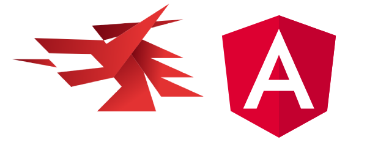

 

# WebCap
---

Aplicación de escritorio, dedicada a la grabación de pantalla, captura de pantalla y conversión de formatos de video, con un enfoque minimalista.

  

Esta dispone de varios ajustes para la comodidad del usuario:
* Definición del video
* Framerate
* Formato del video y la imagen
* Retraso para ajustar cualquier cosa hasta el comienzo de la grabación o de la captura de pantalla
* Activar y desactivar el micrófono
* Elección de pantalla o pestaña a la que grabar
* Cambiar el formato de un video

## Desarrollo
Esta aplicación está desarrollada con HTML, CSS y Javascript con el framework Angular esto en cuanto al frontend. Respecto al backend usa Golang gracias a la biblioteca wails, la cual permite la interoperabilidad de golang y javascript, en este caso typescript, para la creación de aplicaciones de escritorio y realizar llamadas al sistema desde el frontend.

Esta aplicación es una adaptación y mejora de una web desarrollada en otro proyecto.

Hace uso de el software libre FFmpeg para la conversión de videos.

